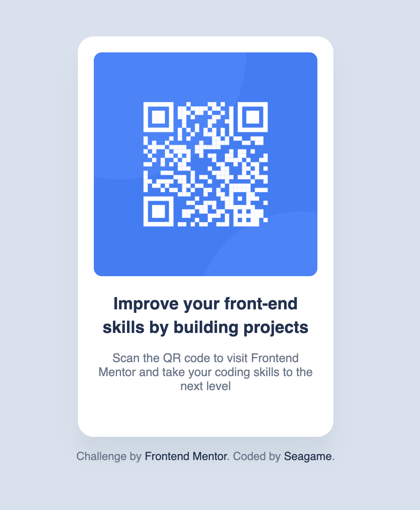

# Frontend Mentor - QR code component solution

This is a solution to the [QR code component challenge on Frontend Mentor](https://www.frontendmentor.io/challenges/qr-code-component-iux_sIO_H). Frontend Mentor challenges help you improve your coding skills by building realistic projects. 

## Table of contents

- [Overview](#overview)
  - [Screenshot](#screenshot)
  - [Links](#links)
- [My process](#my-process)
  - [Built with](#built-with)
  - [What I learned](#what-i-learned)
  - [Continued development](#continued-development)
  - [Useful resources](#useful-resources)
- [Author](#author)
- [Acknowledgments](#acknowledgments)

**Note: Delete this note and update the table of contents based on what sections you keep.**

## Overview

### Screenshot



### Links

- Solution URL: [Add solution URL here](https://your-solution-url.com)
- Live Site URL: [Add live site URL here](https://your-live-site-url.com)

## My process

### Built with

- Semantic HTML5 markup
- CSS custom properties
- Flexbox


### What I learned

Use this section to recap over some of your major learnings while working through this project. Writing these out and providing code samples of areas you want to highlight is a great way to reinforce your own knowledge.

To see how you can add code snippets, see below:


```css
.container {
  display: flex;
  flex-direction: column;
  justify-content: center;
  align-items: center;
}
```
Know definition of align-items in flexbox.For aligned on the cross axis.
```css
.qrImage {
  width: 100%;
  border-radius: 10px;
}
```

If qrImage is nested inside other html element, Use width 100% means will control width of element depend on parent. And border-radius can make round around border.

### Continued development

I will practice more about frontend in topic html and css and framework like react.


### Useful resources

- [Example resource 1](https://www.w3schools.com/css/css_boxmodel.asp) - This helped me for explain about css box model.
- [Example resource 2](https://developer.mozilla.org/en-US/docs/Web/CSS/Reference/Properties/align-items) - explain about align-items. I struggle in this topic for a while. 


## Author

- Frontend Mentor - [@yourusername](https://www.frontendmentor.io/profile/seagame1995)

**Note: Delete this note and add/remove/edit lines above based on what links you'd like to share.**

## Acknowledgments

This is where you can give a hat tip to anyone who helped you out on this project. Perhaps you worked in a team or got some inspiration from someone else's solution. This is the perfect place to give them some credit.

**Note: Delete this note and edit this section's content as necessary. If you completed this challenge by yourself, feel free to delete this section entirely.**
